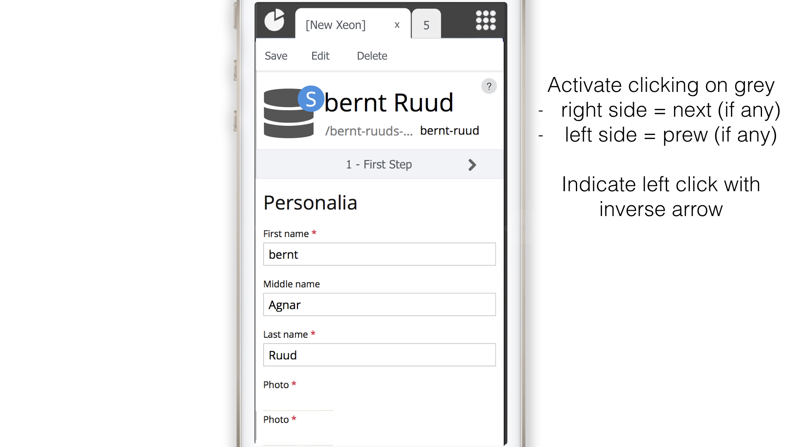
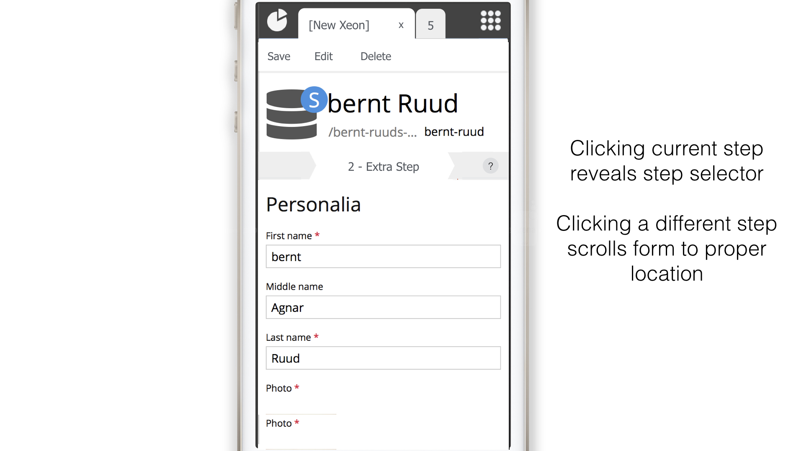
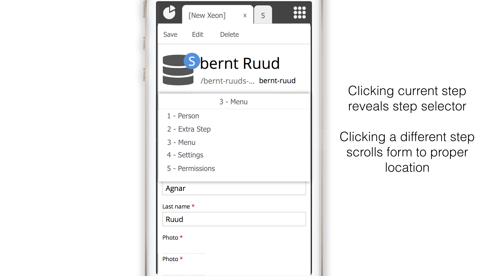
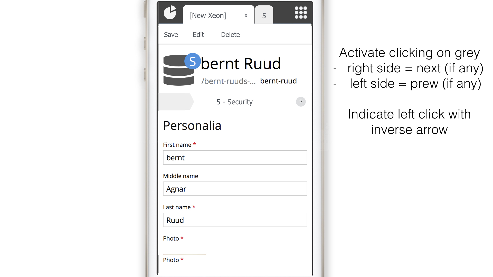

## User story

We need to fix the wizard step panel so it works smoothly on mobile devices and small spaces.

The proposal is to replace the wizard-step-bar when space becomes too small to display the entire list with a dropdown variant. However, it should behave just like today when scrolling (automatically switching between the steps).

Also, when clicking to the left and right of the centered label, it will move you to the next step or back to the previous (almost like the full version works.

## Designs
Below are the suggested design sketches:

